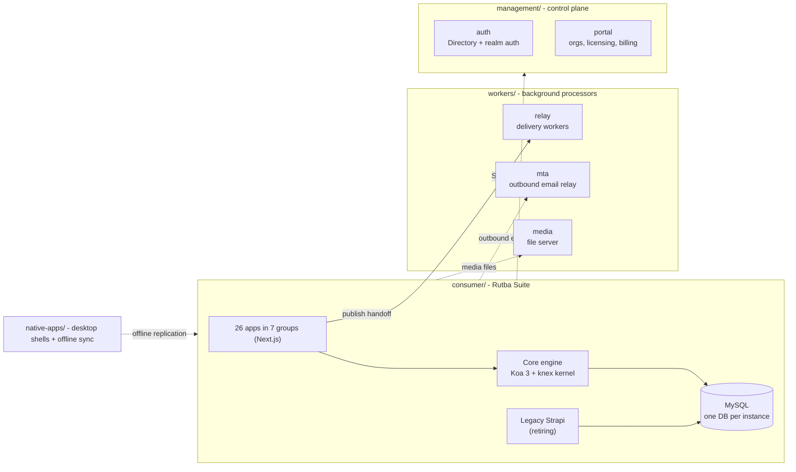

# Rutba

One business-software estate, three tiers, seven git repositories. The consumer
line ships publicly as **Rutba Suite**: twenty-six business apps in seven groups
- sales, inventory, people, finance, content, admin and workspace - sharing one
backend engine, one database per instance and one user/permission provider.
Background processors that serve many products live on the workers tier; the
centrally-run control plane is the management tier.

Customers do not buy "an ERP". They buy **listings** - Rutba CRM, Rutba Mail,
Rutba Docs & Sheets, Rutba Inventory and sixteen more - and each listing grants
entitlements to the individual apps it covers. See
[What a customer actually buys](#what-a-customer-actually-buys).

This is the `rutba` meta-repo - the workspace root. It carries the estate
records ([PLAN.md](PLAN.md), [MIGRATION.md](MIGRATION.md)), the repo map and
clone script ([REPOS.md](REPOS.md)), the versioned guardrail hooks
(`.githooks/`), and the root dev launchers (`rutba.cmd`, `dev.cmd`,
`dev-stop.bat`, `dev-clean.bat` - clears the regenerable `.next` build caches).
Every other directory in the assembled workspace is its own repository, cloned
into place - no submodules.

## The estate



- **Apps talk to the engine.** Every consumer app calls the Core engine
  ([consumer/api/core](https://github.com/eharain/rutba-suite)) - a Koa 3 + knex
  kernel that mounts the domain modules the app groups own, via one fixed
  manifest, against one MySQL database per instance, with one user/permission
  provider seeded from `@rutba/api-client` descriptors. Legacy Strapi runs beside
  it on the same database and retires tranche by tranche.
- **Publishing hands off to the workers tier.** Social/content publishing goes
  through the Relay's delivery workers; the MTA and the media file server are
  shared services many products use.
- **Identity and licensing come from the management tier.** Login federates to
  the Directory at `auth.rutba.io`; the portal owns organizations, licensing,
  billing and provisioning.

Port bands: consumer app line 4000-4099, control plane 4100-4199, other products
4200-4299.

## What a customer actually buys

Three vocabularies do three different jobs, and conflating them is the mistake
this section exists to prevent. They are defined together in
`management/portal/api/billing/migrations/001_plans.sql`.

| Term | What it names | Examples |
|---|---|---|
| `product_key` | what you **buy** - the listing | `crm`, `mail`, `inventory`, `people`, `books` |
| `entitlements.modules` | what you may **use** - per app | `erp.crm`, `erp.leads`, `comm.mail`, `workspace.docs` |
| `provision_product` | what **runs** it - the engine | `erp` |

There are **19 listings and 60 plans** — 41 of them priced, the other 19 the
Custom tiers that go to a conversation rather than a checkout — plus six
bundles, generated into `api/billing/migrations/005_plans_seed.sql` from the
same public catalog the shop window reads, so the two cannot open the day
disagreeing. Between them those listings ship **39 apps**: a listing is what you
subscribe to, and most carry more than one. One purchase can light
several apps: `crm.growth` is `product_key: 'crm'` granting
`["erp.crm","erp.leads","erp.quotes","erp.helpdesk"]` on the `erp` engine - four
sales apps from one listing. The `books` listing lights two, across what looks
like a boundary and is not: the operator's daily bookkeeping surface and the
accountant's workbench are two views of one ledger, and splitting the licence
would mean buying your own books twice.

The `erp.` prefix on module keys is a legacy namespace, not evidence of one
product; newer groups never took it (`comm.*`, `workspace.*`, `drive.*`).
Licences and suspensions are keyed `(org_id, product_key)`, so suspending a
customer's `crm` listing darkens its four sales apps and leaves their `mail`
listing running.

## The repositories

All repos live at `github.com/eharain` and are named `rutba-*` (some capitalized
on GitHub, e.g. `Rutba-Workers`). The directory a repo occupies is not its repo
name - [REPOS.md](REPOS.md) is the exact map.

Fifteen of the original repos (the consumer commons, every app group and product,
`rutba-auth`, and `rutba-portal`) were absorbed into their parent repo as
ordinary tracked content and are retired - see REPOS.md's History section.

| Tier | Repos |
|---|---|
| Root | [rutba](https://github.com/eharain/rutba) (this repo - records, hooks, launchers) |
| Consumer | [rutba-suite](https://github.com/eharain/rutba-suite) (`consumer/` - engine, commons, every app group and product) |
| Workers | [rutba-workers](https://github.com/eharain/Rutba-Workers) (tier root), [rutba-mta](https://github.com/eharain/Rutba-MTA), [rutba-media](https://github.com/eharain/Rutba-Media-FileServer) |
| Management | [rutba-management](https://github.com/eharain/Rutba-Management) (tier root, `auth/` and `portal/`) |
| Native apps | [rutba-native-apps](https://github.com/eharain/Rutba-Native-Apps) (`native-apps/` - desktop shells + offline sync) |

**Which repo owns a directory** is decided by one test: a subdirectory with its
own `.git` is its own repository; one without it belongs to the enclosing parent
repo. Check with `git -C <dir> rev-parse --show-toplevel`, never by reading a
table. `management/portal/` has no `.git` - it is part of `rutba-management`.

## Quickstart

The workspace is assembled by cloning parents before children -
**[REPOS.md](REPOS.md) has the full clone script** and the repo <-> directory
map. In short:

```bash
git clone https://github.com/eharain/rutba.git Rutba2.0
cd Rutba2.0
# then clone the tier repos into place - consumer/, workers/, management/,
# native-apps/ and the two connected workers repos, exactly as scripted in REPOS.md
```

Then point every repo at its versioned guardrail hooks
(`git config core.hooksPath .githooks`), put the `.env` files in place (never
committed) and run installs via the devkit (`consumer/devkit`; service registry
at `management/devkit/services.json`). The
[rutba-suite README](https://github.com/eharain/rutba-suite) covers running the
backends and apps.

## Records

- [PLAN.md](PLAN.md) - the 2.0 design record: tiers, the engine + app-groups
  model, repo boundaries, and the old -> new map from the previous estate.
- [MIGRATION.md](MIGRATION.md) - the migration ledger: what moved, what was
  verified, and the known follow-ups.
- [REPOS.md](REPOS.md) - how the seven repos assemble into one workspace.
