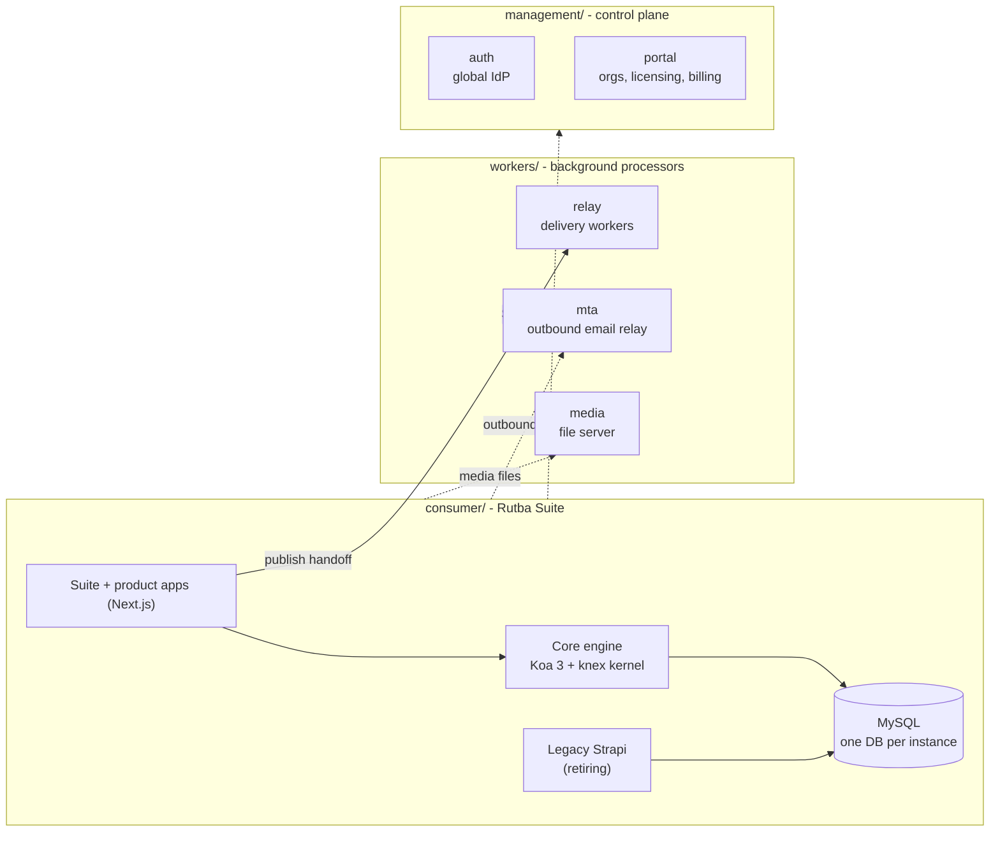

# Rutba

One business-software estate, three tiers, 21 repositories. The consumer line
ships publicly as **Rutba Suite**: six ERP suites (sales, inventory, finance,
people, content, console) running on one shared backend engine, beside six
standalone products (relay, studio, workspace, drive, mail, comms). Background
processors that serve many products live on the workers tier; the centrally-run
control plane is the management tier.

This is the `rutba` meta-repo - the workspace root. It carries the estate
records ([PLAN.md](PLAN.md), [MIGRATION.md](MIGRATION.md)), the repo map and
clone script ([REPOS.md](REPOS.md)), and the root dev launchers (`rutba.cmd`,
`dev.cmd`, `dev-stop.bat`). Every other directory in the assembled workspace is
its own repository, cloned into place - no submodules.

## The estate



- **Apps talk to the engine.** Every suite app calls the Core engine
  ([consumer/api/core](https://github.com/eharain/rutba-suite)) - a Koa 3 + knex
  kernel that mounts 19 domain modules from the suite and product repos via one
  fixed manifest, against one MySQL database per instance, with one
  user/permission provider seeded from `@rutba/api-client` descriptors. Legacy
  Strapi runs beside it on the same database and retires tranche by tranche.
- **Publishing hands off to the workers tier.** Social/content publishing goes
  through the Relay's delivery workers; the MTA and the media file server are
  shared services many products use.
- **Identity and licensing come from the management tier.** Login federates to
  the global IdP; the portal owns organizations, licensing, billing and
  provisioning.

Port bands: ERP line 4000-4099, control plane 4100-4199, other products
4200-4299.

## The repositories

All repos live at `github.com/eharain` and are named `rutba-*`. The directory a
repo occupies is not its repo name - [REPOS.md](REPOS.md) is the exact map.

| Tier | Repos |
|---|---|
| Root | [rutba](https://github.com/eharain/rutba) (this repo - records + launchers) |
| Consumer - engine + glue | [rutba-suite](https://github.com/eharain/rutba-suite) (`consumer/` - the engine), [rutba-commons](https://github.com/eharain/rutba-commons) (`consumer/packages/` - shared packages) |
| Consumer - ERP suites | [rutba-console](https://github.com/eharain/rutba-console), [rutba-sales](https://github.com/eharain/rutba-sales), [rutba-inventory](https://github.com/eharain/rutba-inventory), [rutba-finance](https://github.com/eharain/rutba-finance), [rutba-people](https://github.com/eharain/rutba-people), [rutba-content](https://github.com/eharain/rutba-content) |
| Consumer - products | [rutba-relay](https://github.com/eharain/rutba-relay), [rutba-studio](https://github.com/eharain/rutba-studio), [rutba-workspace](https://github.com/eharain/rutba-workspace), [rutba-drive](https://github.com/eharain/rutba-drive), [rutba-mail](https://github.com/eharain/rutba-mail), [rutba-comms](https://github.com/eharain/rutba-comms) |
| Workers | [rutba-workers](https://github.com/eharain/rutba-workers) (tier root), [rutba-mta](https://github.com/eharain/rutba-mta), [rutba-media](https://github.com/eharain/rutba-media) |
| Management | [rutba-management](https://github.com/eharain/rutba-management) (tier root), [rutba-portal](https://github.com/eharain/rutba-portal), [rutba-auth](https://github.com/eharain/rutba-auth) |

## Quickstart

The workspace is assembled by cloning parents before children -
**[REPOS.md](REPOS.md) has the full clone script** and the repo <-> directory
map. In short:

```bash
git clone https://github.com/eharain/rutba.git Rutba2.0
cd Rutba2.0
# then clone the tier repos into place - consumer/, workers/, management/
# and their children, exactly as scripted in REPOS.md
```

Then put the `.env` files in place (never committed) and run installs via the
devkit (`consumer/devkit`; service registry at `management/devkit/services.json`).
The [rutba-suite README](https://github.com/eharain/rutba-suite) covers running
the backends and apps.

## Records

- [PLAN.md](PLAN.md) - the full 2.0 design: tiers, the engine + suites model,
  repo boundaries, and the old -> new map from the previous estate.
- [MIGRATION.md](MIGRATION.md) - the migration ledger: what moved, what was
  verified, and the known follow-ups.
- [REPOS.md](REPOS.md) - how the 21 repos assemble into one workspace.
