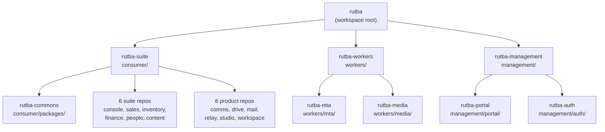

# Rutba 2.0 — Repo ⇄ Workspace Map

How the complete workspace (`D:\Rutba2.0` on the dev box) is constructed from the 21 git
repositories on `github.com/eharain`. Repos are named `rutba-*`; the directory a repo
occupies in the workspace is **not** its repo name — this file is the rename map.

Nesting model: plain nested working trees. Each parent repo `.gitignore`s the directories
that belong to child repos. No submodules.



An arrow means "this repo's directory contains the child repo's working tree" (and
`.gitignore`s it).

## The map

| # | Repo (`github.com/eharain/…`) | Clone into | Owns |
|---|---|---|---|
| 1 | `rutba` | `.` (workspace root) | PLAN.md, MIGRATION.md, REPOS.md, root launchers (`rutba.cmd`, `dev.cmd`, `dev-stop.bat`, `dev-clean.bat`) |
| 2 | `rutba-suite` | `consumer/` | the engine + glue: `api/`, `devkit/`, `config/`, `docs/`, `infra/`, consumer root files |
| 3 | `rutba-commons` | `consumer/packages/` | shared packages: `@rutba/ui`, `api-client`, `video`, `sync`, `marketplace-engine`, `interactions`, … |
| 4 | `rutba-console` | `consumer/console/` | admin suite + the consolidated consumer auth modules |
| 5 | `rutba-sales` | `consumer/sales/` | crm, helpdesk, marketplace, orders, portal, pos, rider |
| 6 | `rutba-inventory` | `consumer/inventory/` | control, manufacturing, stock |
| 7 | `rutba-finance` | `consumer/finance/` | accounts, payroll |
| 8 | `rutba-people` | `consumer/people/` | hr, ess |
| 9 | `rutba-content` | `consumer/content/` | campaigns, cms, mail, social, storefront |
| 10 | `rutba-comms` | `consumer/comms/` | chat / meet / calls |
| 11 | `rutba-drive` | `consumer/drive/` | end-user file storage |
| 12 | `rutba-mail` | `consumer/mail/` | hosted org mailboxes + client |
| 13 | `rutba-relay` | `consumer/relay/` | Social Relay — publish api, console, web, mcp, sdk |
| 14 | `rutba-studio` | `consumer/studio/` | video/image editors + creative libraries |
| 15 | `rutba-workspace` | `consumer/workspace/` | docs & sheets |
| 16 | `rutba-workers` | `workers/` | tier root + marketplace, interactions, relay runner, scaffolds |
| 17 | `rutba-mta` | `workers/mta/` | the MTA — **connected**: continues the surviving `Rutba-MTA` (renamed in place) |
| 18 | `rutba-media` | `workers/media/` | the media file server — **connected**: continues the surviving `Rutba-Media-FileServer` (renamed in place) |
| 19 | `rutba-management` | `management/` | control-plane glue: `platform/`, `infra/`, `devkit/`, tier root files |
| 20 | `rutba-portal` | `management/portal/` | the control plane |
| 21 | `rutba-auth` | `management/auth/` | the global identity provider |

## Construct the workspace

Parents before children; child directories are ignored by their parents, so order within a
tier doesn't matter beyond that.

```bash
git clone https://github.com/eharain/rutba.git Rutba2.0
cd Rutba2.0

# consumer tier
git clone https://github.com/eharain/rutba-suite.git consumer
git clone https://github.com/eharain/rutba-commons.git consumer/packages
for r in console sales inventory finance people content comms drive mail relay studio workspace; do
  git clone "https://github.com/eharain/rutba-$r.git" "consumer/$r"
done

# workers tier
git clone https://github.com/eharain/rutba-workers.git workers
git clone https://github.com/eharain/rutba-mta.git workers/mta      # was Rutba-MTA
git clone https://github.com/eharain/rutba-media.git workers/media  # was Rutba-Media-FileServer

# management tier
git clone https://github.com/eharain/rutba-management.git management
git clone https://github.com/eharain/rutba-portal.git management/portal
git clone https://github.com/eharain/rutba-auth.git management/auth
```

Then: put the `.env` files in place (they are never committed — estate root `.env`,
`consumer/.env*`, `consumer/relay/**/.env`), and run installs via the devkit
(`consumer/devkit`, registry at `management/devkit/services.json`).

Until the GitHub renames land, the two connected repos resolve via their old names
(`Rutba-MTA`, `Rutba-Media-FileServer`); after the rename GitHub redirects both URL forms.

## History

`rutba-mta` and `rutba-media` continue their surviving repos' history — the 2.0 tree landed
as one restructure commit on top. Every other repo starts with a clean 2.0 history by
design. `Rutba-ERP` stays online as the archive of the dissolved monolith and is not
connected; the standalone Strapi plugin repos (`strapi-content-sync-pro`,
`strapi-api-guard-pro`) live outside this workspace with working copies still in the old
estate (`D:\Rutba\packages\strapi-plugins\`).
