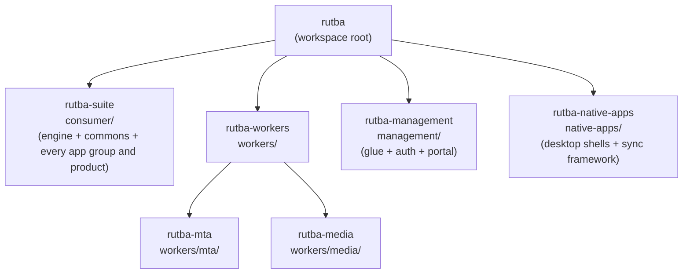

# Rutba 2.0 — Repo ⇄ Workspace Map

How the complete workspace (`D:\Rutba2.0` on the dev box) is constructed from the 7 git
repositories on `github.com/eharain`. Repos are named `rutba-*` (some capitalized on
GitHub, e.g. `Rutba-Workers`); the directory a repo occupies in the workspace is **not**
its repo name — this file is the rename map.

**The ownership test, which outranks this file.** A subdirectory with its own `.git` is its
own repository; one without it belongs to the enclosing parent repo. Verify with
`git -C <dir> rev-parse --show-toplevel`. This document describes the estate as it is
*designed*, and a design document can drift; the working tree cannot. Where the two
disagree, the working tree is right and this file is the bug.

Nesting model: plain nested working trees. Each parent repo `.gitignore`s the directories
that belong to child repos still outside it. No submodules.



An arrow means "this repo's directory contains the child repo's working tree" (and
`.gitignore`s it).

## The map

| # | Repo (`github.com/eharain/…`) | Clone into | Owns |
|---|---|---|---|
| 1 | `rutba` | `.` (workspace root) | PLAN.md, MIGRATION.md, REPOS.md, the canonical `.githooks/`, root launchers (`rutba.cmd`, `dev.cmd`, `dev-stop.bat`, `dev-clean.bat`) |
| 2 | `rutba-suite` | `consumer/` | the engine (`api/`, `devkit/`, `config/`, `docs/`, `infra/`), the commons (`packages/`), and every app group and product (`console`, `sales`, `inventory`, `finance`, `people`, `content`, `facilities`, `logistics`, `assistant`, `comms`, `drive`, `mail`, `relay`, `studio`, `workspace`) |
| 3 | `rutba-workers` (`Rutba-Workers`) | `workers/` | tier root + marketplace, interactions, relay runner, scaffolds |
| 4 | `rutba-mta` (`Rutba-MTA`) | `workers/mta/` | the MTA — **connected**: continues the surviving `Rutba-MTA` history |
| 5 | `rutba-media` (`Rutba-Media-FileServer`) | `workers/media/` | the media file server — **connected**: continues the surviving `Rutba-Media-FileServer` history |
| 6 | `rutba-management` (`Rutba-Management`) | `management/` | control-plane glue (`platform/`, `infra/`, `devkit/`), tier root files, identity (`auth/`), and the control plane itself (`portal/`) |
| 7 | `rutba-native-apps` (`Rutba-Native-Apps`) | `native-apps/` | Windows desktop shells (`apps/*-desktop`), the offline sync framework (`packages/sync`, moved from `consumer/packages/sync` 2026-08-23), and the offline/desktop program docs (`docs/`, moved from `consumer/docs/todo/` same day) |

`management/portal/` is **not** a repo. It was cloned separately until 2026-08-22, when the
ownership test showed it had no `.git` — only a `.github/` directory, and a CI config is not
a clone. Everything under it had therefore been tracked by nothing at all. It is ordinary
tracked content of `rutba-management` now, and the stale `/portal/` rule is gone from
`management/.gitignore`.

## Construct the workspace

Parents before children; child directories are ignored by their parents, so order within a
tier doesn't matter beyond that.

```bash
git clone https://github.com/eharain/rutba.git Rutba2.0
cd Rutba2.0

# consumer tier - one repo covers the engine, the commons and every app group and product
git clone https://github.com/eharain/rutba-suite.git consumer

# workers tier
git clone https://github.com/eharain/Rutba-Workers.git workers
git clone https://github.com/eharain/Rutba-MTA.git workers/mta
git clone https://github.com/eharain/Rutba-Media-FileServer.git workers/media

# management tier - one repo, portal included
git clone https://github.com/eharain/Rutba-Management.git management

# native apps tier (desktop shells + offline sync framework)
git clone https://github.com/eharain/Rutba-Native-Apps.git native-apps
```

Then, in every repo just cloned (the root included), point git at the versioned
guardrail hooks — they reject any AI-tool footprint in identities, messages,
file names or content, at commit time and again at push time:

```bash
git config core.hooksPath .githooks
```

(The child repos with a `package.json` do this themselves via their `prepare`
script; running it by hand covers the root, `management/`, and any repo before its
first `npm install`. This machine also carries the same hooks globally.)

Then: put the `.env` files in place (they are never committed — estate root `.env`,
`consumer/.env*`, `consumer/relay/**/.env`), and run installs via the devkit
(`consumer/devkit`, registry at `management/devkit/services.json`).

## History

`rutba-mta` and `rutba-media` continue their surviving repos' history — the 2.0 tree landed
as one restructure commit on top. `rutba-suite` and `rutba-management` each started with a
clean 2.0 history, then absorbed their remaining child repos as ordinary tracked content on
2026-08-22: `rutba-suite` merged `rutba-commons`, `rutba-console`, `rutba-sales`,
`rutba-inventory`, `rutba-finance`, `rutba-people`, `rutba-content`, `rutba-comms`,
`rutba-drive`, `rutba-mail`, `rutba-relay`, `rutba-studio` and `rutba-workspace`;
`rutba-management` merged `rutba-auth`, and `rutba-portal` followed the same day once the
ownership test was applied to it. Those fifteen GitHub repos are retired, and the two
connected workers repos are the only child repos left. `Rutba-ERP` stays online as the
archive of the dissolved monolith and is not connected; the standalone Strapi plugin repos
(`strapi-content-sync-pro`, `strapi-api-guard-pro`) live outside this workspace with working
copies still in the old estate (`D:\Rutba\packages\strapi-plugins\`).
